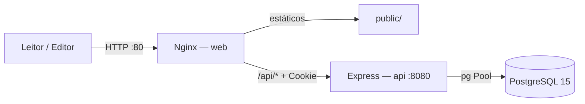
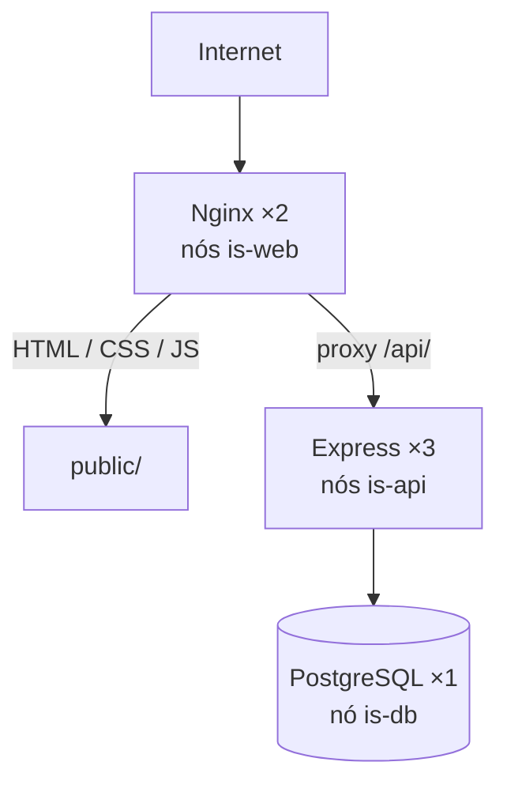

# MadScientist

**A Revista Popular do Conhecimento**

Uma revista digital de ciência — Markdown no laboratório, HTML no navegador — servida por um cluster Docker Swarm com papéis de VM separados para borda, API e banco.

[Português](#visao-geral) · [English](#english-brief)

> Revista popular de ciência, com frontend estático, API Express e PostgreSQL, implantada em VMs rotuladas via Docker Swarm.
>
> A popular-science magazine: static frontend, Express API and PostgreSQL, operated on role-labeled VMs with Docker Swarm.

---

<a id="english-brief"></a>

## English brief

MadScientist is a small editorial product with a deliberately serious backbone. Readers browse articles on a dark, lab-themed site. The editor logs in, uploads a Markdown file, and the post is persisted in PostgreSQL. The browser never talks to the API directly in production: Nginx serves `public/` and reverse-proxies `/api/` to Node.

The interesting part is not the CMS. It is how the same Compose contract runs on a laptop and on a Swarm cluster.

**What I designed, deployed and operated**

- Three-tier Docker Swarm: Nginx ×2 on `is-web` nodes, Express ×3 on `is-api` nodes, PostgreSQL ×1 on an `is-db` node
- Overlay network `swarm_net`, Docker Hub images (`lluuiizzz/madscientist-web`, `lluuiizzz/madscientist-api`)
- Swarm Secrets for `db_password` and `session_secret`; the API reads `/run/secrets/*` and falls back to dev defaults
- Domain target `madscientist.com.br` as Nginx `server_name` (the cluster has been up; this README does not claim it is live right now)

**Stack:** Nginx Alpine · Node 18 / Express 5 · PostgreSQL 15 · Docker Compose overlays · Docker Swarm · bcrypt · express-session · `pg` Pool · Zod (middleware ready)

**Local:** `docker compose up --build` → <http://localhost> (API also on `:8080` for debugging).

**Prod (what I used):** label the nodes, `docker secret create`, build/push Hub images, then:

```bash
docker stack deploy -c docker-compose.yml -c docker-compose.prod.yml madscientist
```

Diagrams, data model, API table, engineering decisions and a concrete upgrade path are in Portuguese below — the code references are the same.

---

<a id="visao-geral"></a>

## Visão geral

MadScientist é uma revista popular de ciência. O leitor cai numa home sombria, lista matérias por categoria e abre o texto completo em `/posts/:slug` sem recarregar a página. O editor entra em `/login`, o painel em `/admin` confirma a sessão e publica a partir de um arquivo `.md`.

Por baixo disso há um sistema em três serviços — **web**, **api**, **db** — escritos para viver em dois mundos sem fork de código: o notebook, com bind-mount e nodemon; e um Swarm multi-nó, com réplicas, secrets e constraints de colocação. O primeiro commit deste repositório já é a configuração de ambiente. A infra não foi colada depois.

O domínio `madscientist.com.br` é o `server_name` do Nginx. A stack **chegou a rodar** em VMs com papéis distintos. Este documento descreve essa operação e como reproduzi-la; não afirma que o cluster está no ar neste instante.

---

## Arquitetura

O browser só enxerga a porta 80. Nginx entrega o frontend e encaminha `/api/` para o Express. O Express fala com o Postgres pelo hostname interno `db`, na overlay `swarm_net`.



Em produção cada serviço tem um **papel de VM**. O Swarm não espalha Postgres no mesmo nó da borda, nem deixa a API competir com o banco por disco.



| Label do nó | Serviço | Réplicas | Responsabilidade |
|---|---|---|---|
| `is-web` | `web` (Nginx Alpine) | 2 | estáticos, `try_files` de SPA, reverse proxy |
| `is-api` | `api` (Node 18 Alpine) | 3 | REST, sessão, bcrypt, acesso ao banco |
| `is-db` | `db` (Postgres 15 Alpine) | 1 | persistência + init do schema via Docker Config |

A API **não publica porta** no compose base. Só o Nginx é alcançável de fora. No override de desenvolvimento a porta `8080` é exposta de propósito, para depurar a API sem passar pelo proxy.

---

## Ambientes: um artefato, dois perfis

Não há um `docker-compose.dev.yml` paralelo copiado à mão. Há um **contrato** de serviços e dois overlays:

```
docker-compose.yml              contrato: web, api, db + imagens Hub + rede
        ├── docker-compose.override.yml     DEV  (merge automático no compose up)
        └── docker-compose.prod.yml         PROD (passado no stack deploy)
```

`docker compose up` aplica a base **mais** o override. `docker stack deploy` aplica a base **mais** o arquivo de prod — o override não entra no Swarm.

| | Desenvolvimento | Produção (Swarm) |
|---|---|---|
| Comando | `docker compose up --build` | `docker stack deploy -c docker-compose.yml -c docker-compose.prod.yml madscientist` |
| Imagens | `nginx:alpine` + build local da API | `lluuiizzz/madscientist-web:latest`, `lluuiizzz/madscientist-api:latest` |
| Código | bind-mount de `./` e `./public` | copiado na imagem |
| Processo da API | `npm run dev` (nodemon) | `npm start` |
| Segredos | defaults no código / env | Docker Secrets em `/run/secrets/` |
| Schema | volume-mount de `01-scheme.sql` | Docker Config `database_scheme` |
| Volume do banco | `db_data_dev` | `postgres_data` |
| Rede | bridge `swarm_net` | overlay attachable |
| Porta da API | `8080:8080` (debug) | interna |
| Réplicas | 1 / 1 / 1 | 2 / 3 / 1 |

O mesmo fallback vive na aplicação. `src/config/db.js` e `src/config/cookies.js` tentam ler o secret montado pelo Swarm e, se o arquivo não existe, usam o valor de desenvolvimento. Um binário, dois ambientes.

---

## Stack

| Camada | Tecnologia | Papel neste repo |
|---|---|---|
| Borda | Nginx Alpine | estáticos, SPA fallback, proxy `/api/`, bloqueio de `*.md` |
| API | Node 18, Express 5 | REST, `trust proxy`, JSON até 50 MB (corpo Markdown) |
| Sessão | `express-session` | cookie `httpOnly`, 24 h, secret via Swarm |
| Auth | bcrypt (cost 12) | senha nunca em claro; `isLogged` no POST de posts |
| Validação | Zod + `middleware/validate.js` | camada pronta, ainda não ligada nas rotas |
| Dados | PostgreSQL 15, `pg` Pool | queries parametrizadas, transação no publish |
| Conteúdo | Markdown + `marked` (CDN) | fonte no banco, HTML no cliente |
| Frontend | HTML / CSS / JS vanilla | History API em `/posts/:slug` |
| Empacote | `Dockerfile` + `Dockerfile.web` | API em Node Alpine; web em Nginx Alpine |
| Orquestração | Compose overlay + Docker Swarm | dev no laptop, prod em VMs rotuladas |
| Registry | Docker Hub | `lluuiizzz/madscientist-web`, `lluuiizzz/madscientist-api` |

---

## Modelo de dados

O schema (`01-scheme.sql`) sobe sozinho na primeira inicialização do container Postgres — como bind-mount em dev, como Docker Config em prod.

**`posts`** — matéria da revista.

| Coluna | Tipo | Por quê |
|---|---|---|
| `id` | `SERIAL` | chave interna |
| `title` | `VARCHAR(255)` | capa |
| `slug` | `VARCHAR(255) UNIQUE` | URL estável (`/posts/o-cha-de-nitrogenio`) |
| `summary` | `TEXT` | card da home |
| `content` | `TEXT` | Markdown puro |
| `author` | `VARCHAR(100)` | default `Mad Scientist` |
| `category` | `VARCHAR(50)` | Química, Física, Código… |
| `tags` | `TEXT[]` | array nativo do Postgres, não tabela N:N prematura |
| `status` | `VARCHAR(20)` | `draft` / `published` — workflow editorial já modelado |
| `published_at` | `timestamptz` | publicação agendada (coluna pronta) |
| `created_at` / `updated_at` | `timestamptz` | auditoria |

Índices: `idx_posts_slug`, `idx_posts_published_at`. Extensão `uuid-ossp` habilitada.

**`users`** — credencial do painel (`username` PK, `pass` = hash bcrypt). Sem senha em claro no banco.

O serviço de publicação abre transação (`BEGIN` / `COMMIT` / `ROLLBACK`) e devolve a conexão no `finally`. Leitura pública projeta só o que a home precisa (`title, summary, category, tags, slug`) — o Markdown completo só sai no GET por slug.

---

## API

O Nginx reescreve `/api/` para a raiz do Express. O frontend chama `/api/posts`; a rota na API é `/posts`.

| Método | Rota (Express) | Auth | Comportamento |
|---|---|---|---|
| `GET` | `/posts` | público | lista matérias para a home |
| `POST` | `/posts` | sessão (`isLogged`) | publica a partir do JSON + Markdown |
| `GET` | `/posts/:slug` | público | matéria completa |
| `PATCH` | `/posts/:slug` | — | stub (`TODO`) |
| `DELETE` | `/posts/:slug` | — | stub (`TODO`) |
| `POST` | `/login` | — | bcrypt + `req.session.isLoggedIn` |
| `GET` | `/login/check-auth` | cookie | o admin usa isso no `DOMContentLoaded` |

Camadas, de fora para dentro:

```
routes  →  controllers  →  services  →  pg Pool
             middleware/isLogged
             middleware/validate   (Zod, reservado)
             models/               (pasta pronta para schemas)
```

---

## Frontend

Três superfícies, todas estáticas, todas atrás do Nginx:

- **`/`** — home. `fetch('/api/posts')`, cards, clique interceptado, `pushState` para `/posts/:slug`. O Markdown vira HTML com `marked.parse`. Voltar para a lista também é History API, sem F5.
- **`/login`** — POST `/api/login`. O Set-Cookie atravessa o proxy (`proxy_set_header Cookie` + `proxy_pass_header Set-Cookie` no `nginx.conf`). Sem isso a sessão morre no Nginx.
- **`/admin`** — checa `/api/login/check-auth`; se 401, redireciona. O editor descreve título, slug, categoria, tags e summary e anexa um `.md`. O arquivo é lido no browser (`FileReader`) e enviado como JSON.

Deep links sobrevivem a um refresh porque o Nginx faz `try_files $uri $uri/ /index.html`. Arquivos `.md` no docroot são negados — o conteúdo editorial não é um estático adivinhável.

---

## Como rodar em desenvolvimento

Docker e Docker Compose. O override entra sozinho.

```bash
git clone git@github.com:lluuiizz/madscientist.com.br.git
cd madscientist.com.br
docker compose up --build
```

| URL | O que é |
|---|---|
| <http://localhost> | revista (Nginx) |
| <http://localhost/login> | acesso ao painel |
| <http://localhost/admin> | publicação |
| <http://localhost:8080> | API direta, para debug |

O Postgres sobe com `madscientist_database` / `dev_admin` e aplica `01-scheme.sql`. O usuário do painel é criado uma vez, com hash bcrypt (cost 12), via script de bootstrap contra o pool da API — a senha não vive neste README.

Sem Docker, a API também aceita `npm install && npm run dev`, com `PORT` (default `8080`) e `DB_HOST` / `DB_PASSWORD` apontando para um Postgres acessível.

---

## Como implantar em produção

Este foi o fluxo que usei para subir a stack em VMs Swarm. Imagens vão para o Hub; o manager só recebe compose + secrets + labels.

**1. Construir e publicar as imagens**

```bash
docker build -t lluuiizzz/madscientist-api:latest .
docker build -f Dockerfile.web -t lluuiizzz/madscientist-web:latest .
docker push lluuiizzz/madscientist-api:latest
docker push lluuiizzz/madscientist-web:latest
```

**2. Papéis nas VMs**

```bash
docker node update --label-add is-web=true  <node-web>
docker node update --label-add is-api=true  <node-api>
docker node update --label-add is-db=true   <node-db>
```

Um nó pode acumular labels se o laboratório for pequeno; as constraints continuam descrevendo a intenção: borda, compute e estado em eixos diferentes.

**3. Secrets (externos — não entram no Git)**

```bash
printf '%s' "$DB_PASSWORD"    | docker secret create db_password -
printf '%s' "$SESSION_SECRET" | docker secret create session_secret -
```

A API lê `/run/secrets/db_password` e `/run/secrets/session_secret`. O Postgres usa `POSTGRES_PASSWORD_FILE`. O schema chega como Config `database_scheme` → `/docker-entrypoint-initdb.d/01-scheme.sql`.

**4. Stack**

```bash
docker stack deploy -c docker-compose.yml -c docker-compose.prod.yml madscientist
```

O Nginx escuta `:80` com `server_name madscientist.com.br www.madscientist.com.br`. TLS não faz parte desta versão da borda (ver [evolução](#evolucao)).

---

<a id="decisoes"></a>

## Decisões de engenharia

1. **Compose overlay em vez de dois stacks.** O contrato `web` / `api` / `db` é único. Dev acrescenta volume e nodemon; prod acrescenta réplicas, secrets e placement. Menos drift entre ambientes.
2. **Secrets do Swarm, não env no YAML de produção.** Senha do banco e secret da sessão não ficam no Git. O fallback para arquivo ausente é o que permite o mesmo `src/config` no laptop.
3. **Placement por papel de VM.** Postgres pede disco estável; Nginx pede rede; API pede CPU. Labels (`is-web`, `is-api`, `is-db`) tornam isso explícito no orquestrador.
4. **Nginx como única face pública.** A API não tem publish de porta em prod. Cookie, `X-Real-IP` e `Host` são reencaminhados; o Express liga `trust proxy`.
5. **Markdown como fonte da verdade.** Quem escreve ciência escreve `.md`. O banco guarda o fonte; o cliente renderiza; o Nginx recusa `.md` estático.
6. **SQL do Postgres de verdade.** `TEXT[]` para tags, índices alinhados às leituras públicas, queries com `$1…$n`, transação no insert. Sem ORM no caminho quente.
7. **Sessão em cookie httpOnly, não JWT no localStorage.** O painel é same-origin atrás do proxy. `check-auth` é a trava da UI; `isLogged` é a trava do POST.
8. **Frontend sem bundler.** Três páginas, CSS próprio, History API. O custo operacional fica no Swarm, não numa pipeline de assets.

---

<a id="evolucao"></a>

## Evolução

O desenho atual aguenta um laboratório editorial. Os upgrades abaixo estão agrupados pela **necessidade que os dispara**, não por uma lista de débitos.

### Se as 3 réplicas da API passarem a importar de verdade

Hoje a sessão vive no `MemoryStore` do processo. Com três réplicas isso não compartilha estado: o login pode cair numa instância e o `check-auth` em outra.

- Store compartilhado — Redis ou `connect-pg-simple` no Postgres que já existe
- Healthchecks + rolling update no Swarm, para não derrubar o editor no deploy
- Sticky sessions só como paliativo, não como arquitetura

### Se o domínio voltar a ser público

A borda escuta HTTP. `cookie.secure` está `false`. PATCH/DELETE ainda não exigem login. Markdown entra no `innerHTML` sem sanitizar.

- TLS na borda (Certbot no Nginx, ou Traefik/Caddy na frente do Swarm)
- `cookie.secure = true` quando `NODE_ENV=production`
- `helmet`, rate limit no `/login`, auth em PATCH/DELETE
- Sanitizar o HTML do `marked` (DOMPurify) antes de injetar

### Se virar produto editorial

O schema já tem `status`, `published_at` e tags. A API ainda lista tudo e o CRUD para no create.

- Ligar o Zod que já está em `middleware/validate.js` e preencher `src/models/`
- Implementar `updatePost` / `deletePost`
- Filtrar `status = 'published'` na home; usar `published_at` para agendar
- Página por categoria/tag, busca, RSS

### Se virar operação contínua

- GitHub Actions: test → build → push Hub → `stack deploy`
- `.gitignore` / `.dockerignore` de verdade; build multi-stage da API
- Backup do volume `postgres_data` (`pg_dump` periódico)
- Logs estruturados e um `/health` que o Swarm consiga sondar
- IaC (Ansible ou Terraform) para provisionar as VMs, instalar o engine e aplicar os labels — hoje esse passo é manual no nó

Kubernetes não é o próximo passo natural. O Swarm, os secrets e as constraints já expressam o modelo mental certo para este tamanho. O salto seria justificado por multi-ambiente gerenciado, operators ou uma equipe maior — não por moda.

---

## Estrutura do repositório

```
madscientist.com.br/
├── docker-compose.yml              contrato dos três serviços
├── docker-compose.override.yml     perfil DEV
├── docker-compose.prod.yml         perfil Swarm
├── Dockerfile                      API (node:18-alpine)
├── Dockerfile.web                  borda (nginx:alpine)
├── nginx.conf                      estáticos + proxy /api/ + deny *.md
├── 01-scheme.sql                   init do Postgres
├── server.js                       listen na PORT (default 8080)
├── src/
│   ├── app.js                      Express, session, trust proxy
│   ├── config/db.js                Pool + secret file fallback
│   ├── config/cookies.js           session secret fallback
│   ├── routes/                     posts, login
│   ├── controllers/
│   ├── services/                   SQL + bcrypt
│   ├── middleware/                 isLogged, validate (Zod)
│   └── models/                     reservado
└── public/                         home, login, admin
```

---

## Autor

**Luiz Guilherme C. Silva**

Revista, API, Dockerização, ambientes dev/prod e a operação em Swarm — um único repositório, de propósito. Serve como recorte do que eu construo quando o produto é pequeno e a responsabilidade de manter no ar não é.

- GitHub: [lluuiizz](https://github.com/lluuiizz)
- Repositório: [lluuiizz/madscientist.com.br](https://github.com/lluuiizz/madscientist.com.br)
